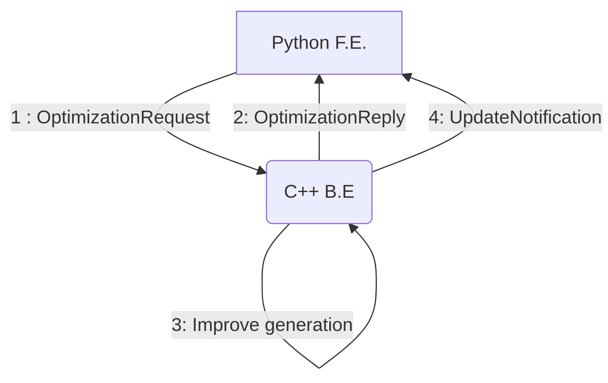

# Travelling salesman optimiser through genetic algorithm

Proposed an algorithm to find solutions close to the optimal to the travelling salesman problem using a genetic algorithm.
- Cross over operator : [Edge Recombination cross over](https://en.wikipedia.org/wiki/Edge_recombination_operator)
- Mutation operator : Random reverse of segment
- Selection operator : Raw selection of the best X individuals
- Fitness evaluation : Takes the sum of the square of the distance between points

The particularity of this project is that the algorithm is entirely done in C++, but the FE is done in python and display in real time the result.

Originally, the project has been done with Paul Bourmaud and me. We were using [setuptools](https://pypi.org/project/setuptools/) to ensure the C++-Python binding.

However this design makes it hard to interact with the algorithm as it run. Using a [gRPC](https://grpc.io/) communication between two components allows maximum usage of C++ processing speed, and python easyness to use.

This project just uses the best algorithm combination found in the previous project, but re-implement them to be gRPC-friendly.


## Table of Contents
- [Features](#Features)
- [Tech Stack & Architecture](#TechStack&Architecture)
- [Installation](#Installation)

## Features

- Optimise Button will try to find the best solution
- Click on the solution canvas to add points yourself
- Real time update button allows the FE to be updated as the process is running
- You cannot optimise 2 configurations at the same time from the F.E.
- BestScore of the graph is the Fitness value : The sum of the SQUARE of the distance between points


## Tech Stack & Architecture

This TSP optimiser uses [gRPC](https://grpc.io/) and [Protobuf](https://protobuf.dev/) to communicate between the F.E. and the B.E.

In /messages you can find the .proto files necessary to the communication.

Python F.E. uses [TKinter](https://docs.python.org/fr/3.13/library/tkinter.html) and a TKinter [matplotlib embedding](https://matplotlib.org/3.1.0/gallery/user_interfaces/embedding_in_tk_sgskip.html) to display the result.

C++ B.E. receives the Optimization request with all the coordinates and some parameters.
It then processes the request, and when finding a better solution than previously, it sends an update to the F.E. to show it.




## Installation

cloning the project
```bash
git clone https://github.com/AlexandrePrevot/TravellingSalesmanProblemOptimiser.git;
```

To be able to build the B.E. :
[Download and compile gRPC](https://grpc.io/docs/languages/cpp/quickstart/#install-grpc
)

Don't forget to update your .bashrc

Build the B.E.
```bash
mkdir build; cd build;
cmake -DCMAKE_BUILD_TYPE=Release -DCMAKE_EXPORT_COMPILE_COMMANDS=1 ../TravellingSalesmanProblemOptimiser/backend/
make
```
both options are not necessary, but can be usefull to who ever wants to modify the project.

To be able to run the F.E. :
```bash
sudo apt install python3-tk
pip install matplotlib
pip install grpcio
python3 -m pip install grpcio-tools
```

once done go to the project root folder and run
```bash
./run.sh [path to your cmake build folder]
```

> **IMPORTANT**  make sure to turn off the C++ server once you're done with the FE. the .sh script is only here to ease the start of the application

